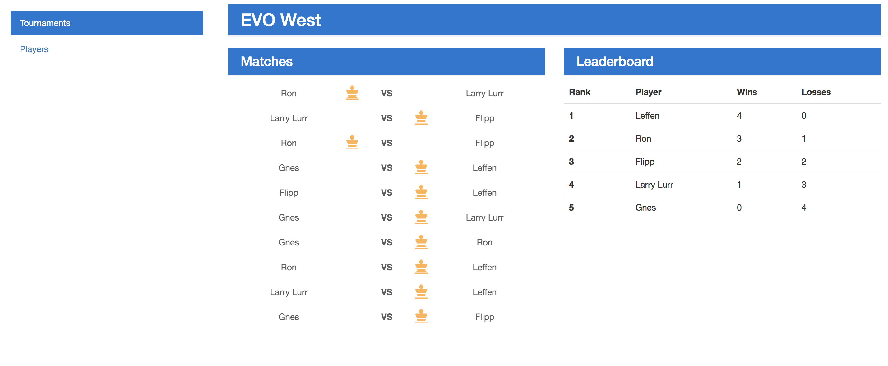

# MEAN Tournament Simulator

A barely functional prototype of tournament simulator on the MongoDB - ExpressJS - AngularJS - NodeJS stack, a by-product from my learning process as I try to put the following technologies together. 

Technologies used:

- [NodeJS + NPM](https://nodejs.org/en/) as the ecosystem
- [Angular 4 + Typescript](https://angular.io/docs/ts/latest/quickstart.html) for the front-end
- [Angular CLI](https://github.com/angular/angular-cli) for development
- [ExpressJS](https://expressjs.com/) for the back-end web application framework
- [Babel](https://babeljs.io) + [Flow](https://flow.org/) for static typing and transpiling server-side code
- [MongoDB + Mongoose](http://mongoosejs.com/) for the database
- [Heroku + Heroku CLI](http://heroku.com) + [mLab add-on](https://mlab.com/) to simplify deployment

Credits to [this article](https://devcenter.heroku.com/articles/mean-apps-restful-api) for the initial guidance.

## TODO

This web application is by no means the best way to implement a tournament simulator, nor it is intended to be functional to a normal user. There are various improvements (or rather, fixes) I'm seeing:

### Must-Do

- Add deleting of tournaments
- Visual feedback of empty lists (of Tournaments, Players, etc)
- More vigorous server-side validation during Tournament and Player creation

### Nice-To-Do

- Undoing match results
- More types of tournaments, and more options to customize tournaments

### Do-If-Too-Free

- Left & right arrow keys to submit match result
- Try adding tests

This project was generated with [Angular CLI](https://github.com/angular/angular-cli) version 1.0.0.

## Setting Up For Development

1. Install [NodeJS + NPM](https://nodejs.org/en/) on your system
2. In the project directory, run `npm install`
3. To start or restart a local server for development, run `npm run start` (no watching implemented yet)
  - `npm run build-app` will only rebuild the Angular app (client-side)
  - `npm run build-express-app` will only rebuild the Express app (server-side)
  - `node server.js` will only start the server

## Code scaffolding

Run `ng generate component component-name` to generate a new component. You can also use `ng generate directive/pipe/service/class /module`.

## Running unit tests

No tests exist - yet.

## Further help

To get more help on the Angular CLI use `ng help` or go check out the [Angular CLI README](https://github.com/angular/angular-cli/blob/master/README.md).
